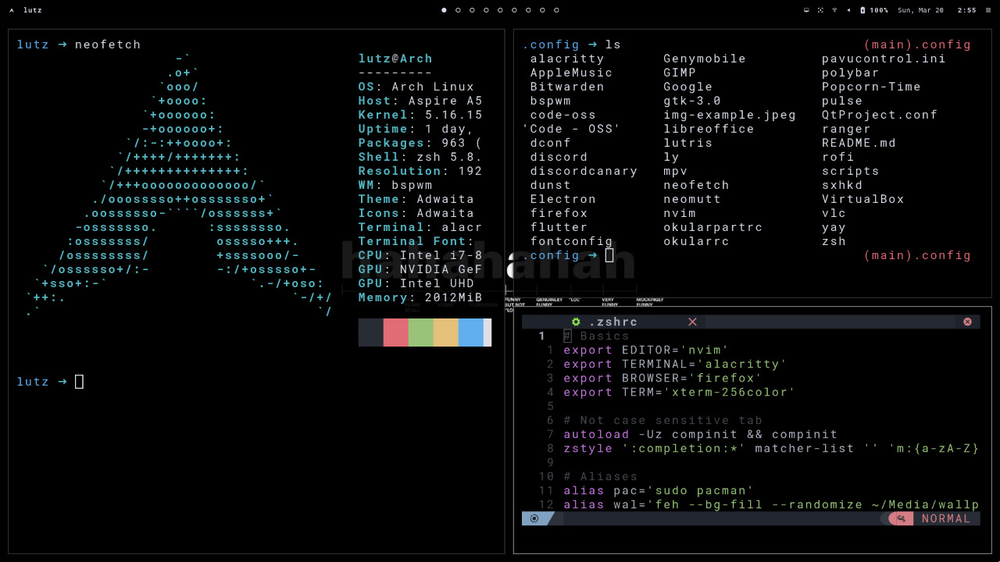

# Lütz dotfiles

## Goals

This repository has a few goals in mind, they are all pretty simple:

- Inspire people to mess with their configuration files.
- Inspire people to move to Linux.
- Make it easy to configure new desktop environments.

## Contents

What configuration files are those?

- [x] [alacritty](#alacritty) config
- [ ] [bspwm](#bspwm) config
- [ ] [dunst](#dunst) config
- [x] [ly](#ly) config
- [ ] [neomutt](#neomutt) config
- [ ] [neovim](#neovim) config
- [x] [polybar](#polybar) config
- [ ] [ranger](#ranger) config
- [x] [rofi](#rofi) config
- [x] useful [scripts](#scripts)
- [x] [sxhkd](#sxhkd) config
- [x] [zsh](#zsh) config

 unchecked boxes are configurations I'm still unhappy about...

#### alacritty

The main objective of this [alacritty][alacritty] config is to 
make it look good. I'm using the _One Half Dark_
color scheme and the font I'm using is the 
RobotoMono Nerd Font Mono.\

#### bspwm

[bspwm][bspwm] is an area I could not explore yet. The 
configuration I have done is minimal, basically
starting some apps, setting up my keyboard layout,
the cursor style and a random wallpaper from my
wallpapers folder.

#### dunst

[Dunst][dunst] is another config I have barely touched.
After setting up the size, colors and a few other
small configurations I have not touched this file.
I plan on doing so on the future, that's why it is 
not yet marked in the contents section.

#### ly

[ly][ly] is a "lightweight TUI (ncurses-like) display 
manager for Linux and BSD". I did not use display
managers for quite some time. I always thought 
they were unnecessary and bloat. However, once I 
saw this simple dm it won my heart, this config
is basically the same as the default, there is not much
to change.

#### neomutt

This is completely new to me. I do not even use 
[neomutt][neomutt] daily yet. I added this config in here 
because I'm certain I will be using it consistently
and will want to change some stuff.

#### neovim

[Neovim][neovim] is simply amazing. I love it. I left it 
unchecked because, for now, I'm using [NvChad][nvchad]. It's  
basically a preconfigured version of neovim. I still
plan on making my own. However, I did not have the
time to configure and organize it, especially with 
lua, that they are now supporting.

#### polybar

This is the part where it gets shady for me. I 
basically copied makc's [polybar][polybar] configurations 
with only a few minor differences. I really loved
the way he designed the bar, really minimalistic,
useful but still beautiful.

#### ranger

[Ranger][ranger] is another of those tools that I know I'll
use and configure, I simply did not take the time
to do that yet. For now it will continue unchecked.

#### rofi

I've used dmenu but it simply does not have the 
same adaptability that [rofi][rofi] has. I have made some 
configuration in it that makes me happy. It's not 
perfect but making it better is not on the top of 
my priority list.

#### scripts

I do not have experience in scripting before. For 
now this folder contains a few scripts I've found 
and used. I am 100% sure that it will contain my 
own scripts sooner than later.

#### sxhkd

I have not explored too much with [sxhkd][sxhkd] as well.
After setting up some basic macros it was good 
enough for me. I do not plan on changing it that 
much, unless it becomes a problem. It's checked 
because I'm happy with it's state.

#### zsh

The [z-shell][zsh] is amazing. I've been using it since 
I first moved to linux and I'm not planning on 
moving away from it. It contains some useful 
aliases, case insensitive tab completion, a pretty 
prompt, a git specific prompt and a few paths.

## Inspiration

Most of the inspiration I got to move from Windows
to Arch Linux was taken from youtubers, my curiosity
made me change OS and, despite having some problems 
here and there, I do not regret it one bit. It has 
been an amazing experience. I have learned a lot 
and I know that there's still much to learn.
\
\
Some of the youtubers that got me into ricing were 
[Makc][makccr], [Brodie Robertson][brodie] and 
[Eric Murphy][murphy]. Whether by having a nice 
desktop, presenting new apps or even making some 
simple tutorials for a beginner like me really 
helped and inspired me to keep going, growing and 
learning.

[makccr]: https://github.com/makccr/dot
[brodie]: https://github.com/BrodieRobertson/dotfiles
[murphy]: https://github.com/ericmurphyxyz/archrice

[alacritty]: https://github.com/alacritty/alacritty
[bspwm]: https://github.com/baskerville/bspwm
[dunst]: https://github.com/dunst-project/dunst
[ly]: https://github.com/fairyglade/ly
[neomutt]: https://github.com/neomutt/neomutt
[neovim]: https://github.com/neovim/neovim
[nvchad]: https://github.com/NvChad/NvChad
[polybar]: https://github.com/polybar/polybar
[ranger]: https://github.com/ranger/ranger
[rofi]: https://github.com/davatorium/rofi
[sxhkd]: https://github.com/baskerville/sxhkd
[zsh]: https://zsh.sourceforge.io/
